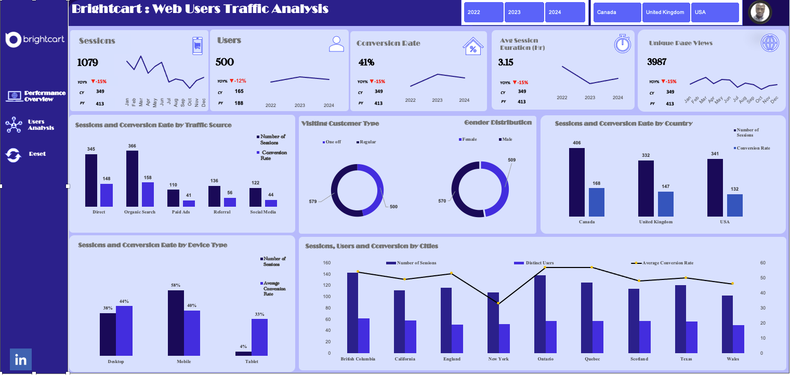
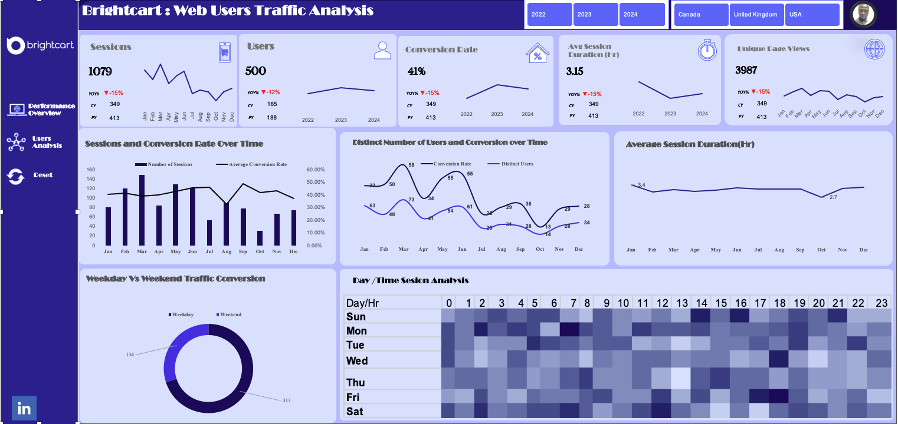

# BrightCart : Maximizing Online Retail Performance Analysis
## 1. Overview

This repository contains the data analysis and strategic recommendations derived from the "BrightCart: Maximizing Online Retail Performance" project. The goal was to transform raw e-commerce session data (2022-2024) into actionable insights focused on optimizing marketing spend, improving conversion rates, and better understanding customer behavior (time, device, and source).

The outcome is a clear data-driven strategy to eliminate guesswork and focus resources on proven areas of high return.

## 2. Key Performance Indicators

The analysis covered a comprehensive dataset with the following key metrics:

Metric

Value

Total Sessions  1,079

Distinct Users  500

Total Conversions 447

Overall Conversion Rate 41.4%

## 3. Core Problems Solved

This analysis addresses the core challenges BrightCart faced:

Bad Timing: Scheduling promotions blindly, missing peak activity windows.

Wasted Spend: Inefficient resource allocation due to a lack of ROI data per channel.

Funnel Leaks: High traffic not converting efficiently due to friction points.

## 4. Key Analysis & Insights 

A. Peak Engagement (Traffic Timing)

 Peak conversion activity occurs consistently during weekday mornings (7 AM - 11 AM) and surprisingly, on Sunday afternoons (2 PM - 3 PM).

 Marketing campaigns should be deployed immediately before these windows.

B. Conversion Performance ( Monthly Trend)

 Conversion Rate peaked at an exceptional 58% in March, indicating a massive success event (likely inventory or campaign related) that must be identified and replicated.

C. Channel Efficiency ( Traffic Source CR)

Direct Traffic converts at a highly efficient 65%, reflecting strong brand loyalty. In contrast, Social Media converts poorly at 25%, requiring an urgent strategy pivot.

D. Device Priority ( Device Analysis)

 68% of site traffic is mobile. Any friction or poor performance on mobile devices immediately impacts the majority of potential revenue.

E. Geographic Performance ( Regional CR)

 The USA leads in volume and performance (45% CR), but Canada (38% CR) and the UK (35% CR) show sufficient conversion quality to justify tailored, localized investment to boost volume.

F. User Segmentation (Chart 6: New vs. Returning)

 Returning Users convert at 55% (2.75x higher) compared to New Users at 20%. Customer retention is the most profitable growth lever.

G. Platform Stability ( Session Duration)

 Average Session Duration is stable (around 3.15 hours over 3 years). This confirms that the focus should be on maximizing conversions within the current average visit length, not artificially extending time-on-site.

H. Funnel Friction ( Checkout Drop-off)

 The critical drop-off point is a 35% leak between the product detail page and the initiation of checkout. This leak is likely caused by unexpected costs (shipping) or friction (mandatory account creation).
 

## 5. Strategic Recommendations

The following five strategic actions are recommended to drive optimal performance and ROI:

Optimize Timing (Target Peak): Schedule promotional activities just before 7 AM on weekdays and 2 PM on Sundays to capitalize on peak engagement, eliminating traffic timing uncertainty.

Boost Retention (Focus on Loyalty): Prioritize budget allocation toward loyalty programs, personalized email campaigns, and re-targeting to maximize the value of the highly efficient Returning User segment (55% CR).

Perfect Mobile UX (Mobile-First Mandate): Implement rigorous performance testing and speed optimization specifically for the checkout flow on mobile devices, where 68% of traffic originates.

Fix Checkout Friction (Reduce 35% Leak): Immediately test solutions like transparent pricing, clear return policies, and offering a mandatory guest checkout option to address the massive 35% drop-off before the final purchase step.

Rework Social Strategy (Quality over Quantity): Pivot the Social Media budget away from direct-sale objectives (25% CR) toward upper-funnel goals like brand awareness and high-quality lead generation, using stronger re-targeting funnels for social clicks.

6. Technologies Used

Data Analysis: Microsoft Excel (cleaning, transformation, aggregation)
